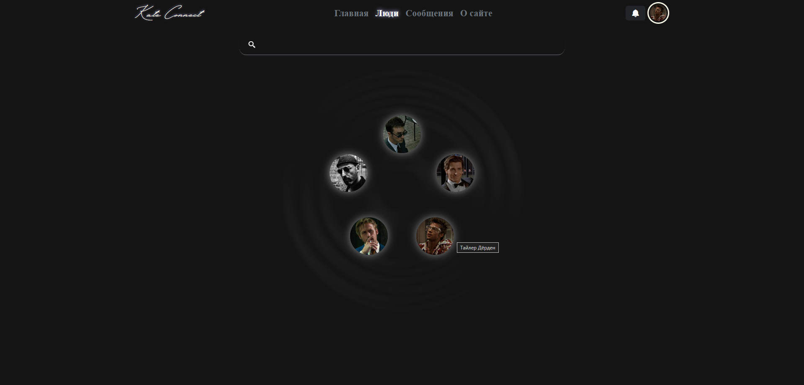

# Мессенджер, основанный на фреймворке FastAPI

  

Данный мессенджер на данный момент активно развивается, расширяя свой функционал.

Реализует в себе трёхслойную микросервисную архитектуру:
- Слой API
- Слой бизнес-логики (BLL)
- Слой доступа к данным (DAL)

Клиент-серверное взаимодействие построено на технологиях REST API, а также WebSockets.
